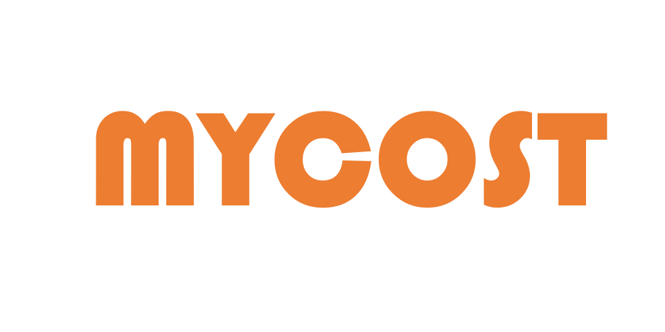
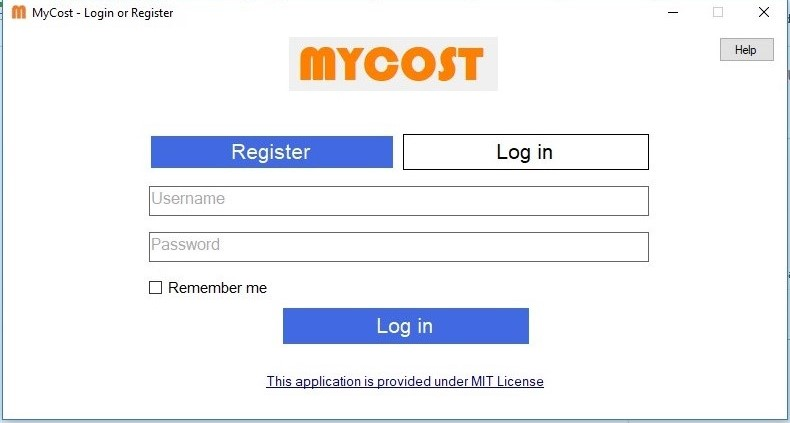
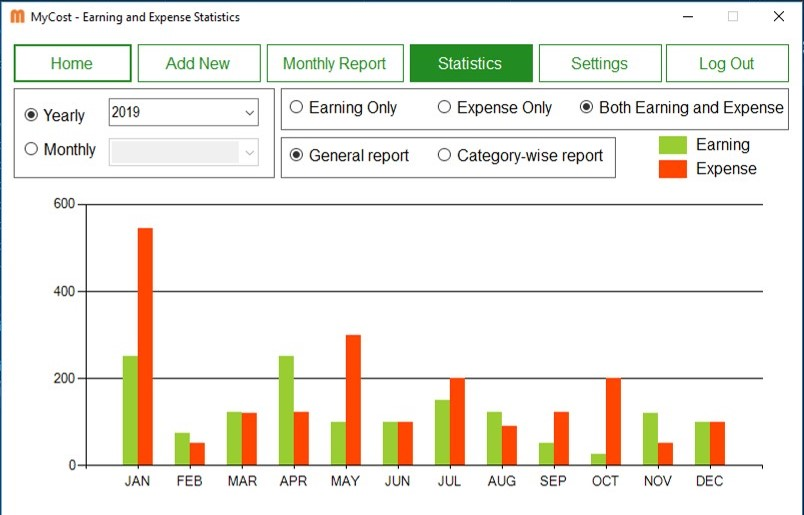

<html>

</html>

              
## Welcome to MyCost
MyCost is a simple personal finance management application for Windows OS. Users can use the application to keep record of their earnings and expenses and see yearly or monthly statistics. It is a Windows Form Application that uses C#, .NET on the client side and PHP on the server side.

## Contribution
You are encouraged to contribute to producing a more secure and better version of the application.

## License
The application is distributed under [MIT License](https://github.com/rezaSaker/MyCost/blob/master/LICENSE)

## Installation

 - It is a Visual Studio project. [Click here](https://visualstudio.microsoft.com/downloads/) to install the latest version of Visual Studio.
 - This project requires .NET Framework 4.6.1
 - if cloned for modification, following change in the project's ```GlobalSpace.cs``` class is required
    ```
    public const string ServerAddress = "Your own server address (Ex: localhost)";
    ```
 - All PHP files in **MyCost API** folder have to be uploaded to the server address defined in ```GlobalSpace.cs``` class.

## Output Examples


