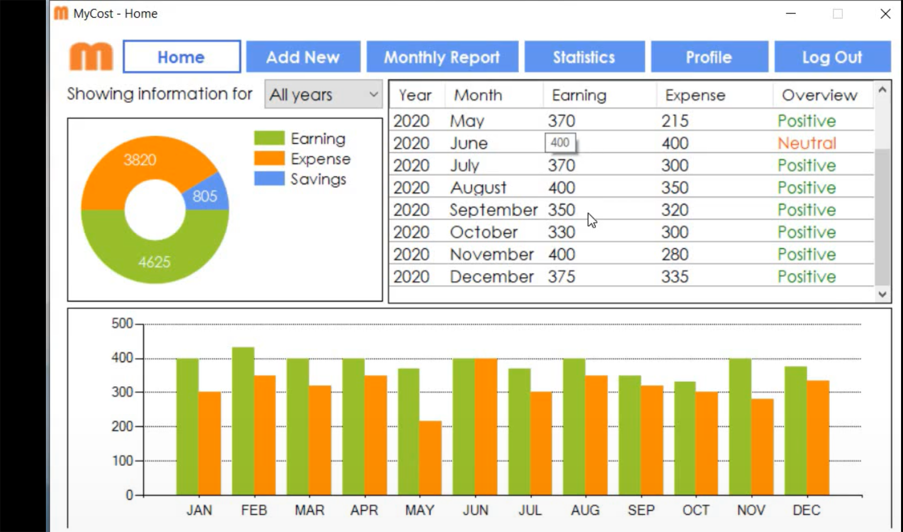
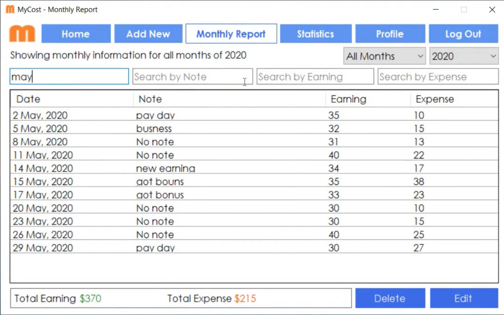
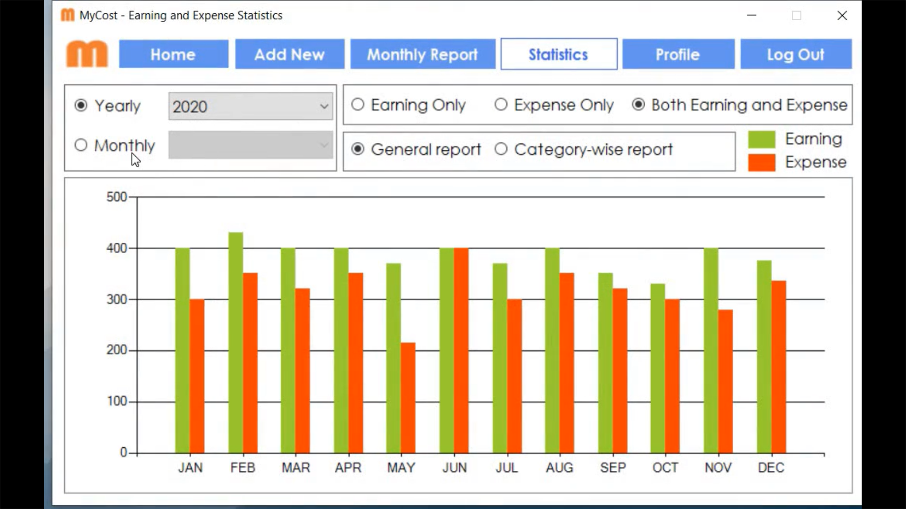
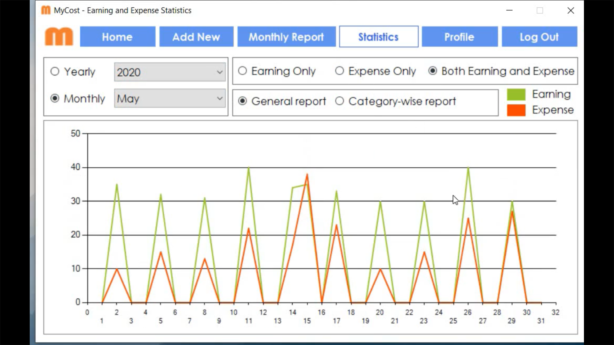

<html>

</html>

              
## Welcome to MyCost
MyCost is a simple personal finance management application for Windows OS. Users can use the application to keep record of their earnings and expenses and see yearly or monthly statistics. It is a Windows Form Application that uses C#, .NET on the client side and PHP on the server side.

## Contribution
You are encouraged to contribute to producing a more secure and better version of the application.

## License
The application is distributed under [MIT License](https://github.com/rezaSaker/MyCost/blob/master/LICENSE)

## Installation

 - [Click here](https://rezasaker.com/rezasdev/dev/soft/mycost/) to install the latest version of MyCost Application.

## Screenshots of the Application
 - Blurred due to resolution
 

