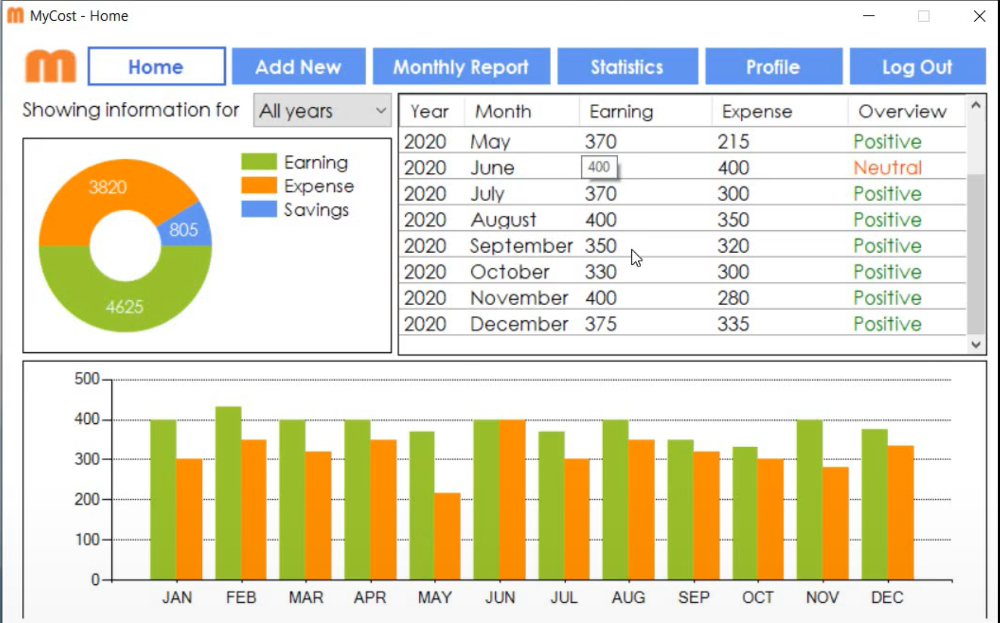
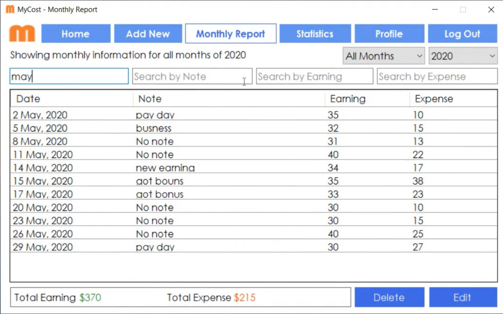
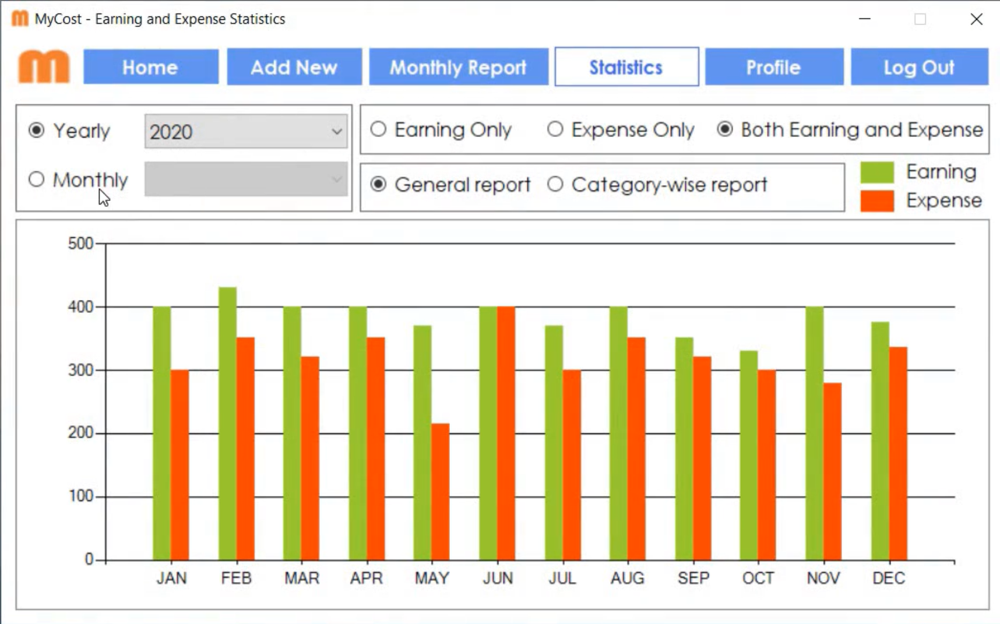
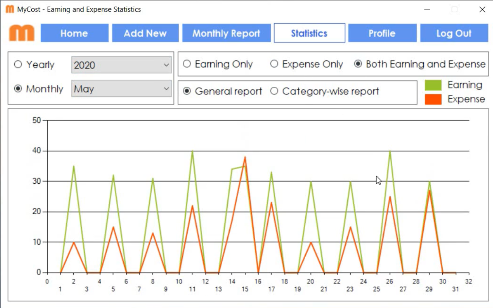

<html>

</html>

              
## Welcome to Phinanze
Phinanze is a Windows PC application for personal finance management. The application can be used for tracking earnings, expenses, and generate reports and statistics for different time periods. This interactive design and simplistic features make the app an convenient tool for keeping track of personal earnings and expenses. I developed this application as a hobby project in 2019 summer and initially named it MyCost which I recently changed to Phinanze to better reflect the app's functionality.   

## License
The application is distributed under [MIT License](https://github.com/rezaSaker/MyCost/blob/master/LICENSE).

## Download the application 

 - [Click here](https://rezasaker.com/rezasdev/dev/soft/mycost/download) to install the latest version of MyCost Application.

## Propsed Feature
Have plan to add a budget feature to the app to make it more usable.  

## Screenshots of the Application
 - Images below might appear blurred due to image resolution.

