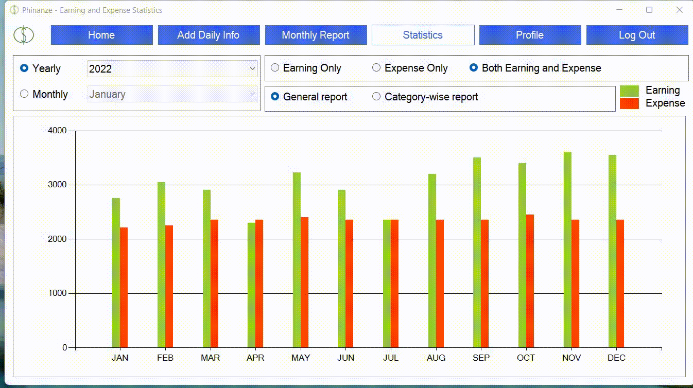
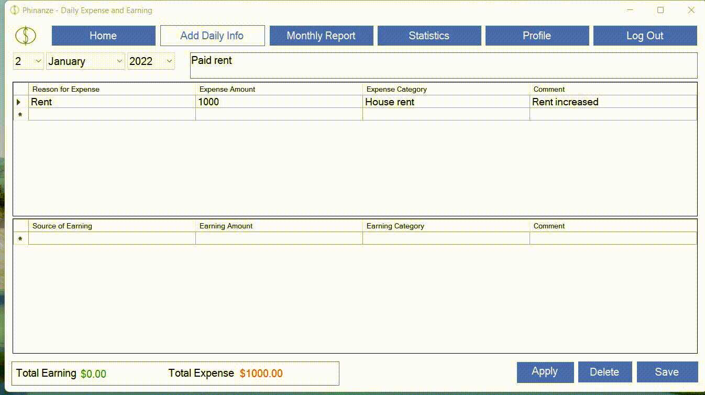

<html>

</html>

## Welcome to Phinanze
Phinanze is a Windows PC application for personal finance management that can be used for tracking earning and expense records, managing records with dynamic search and filter options, and generating useful reports and statistics. The interactive and easy-to-use design makes the app a convenient tool for simple personal finance management. I developed this application as a hobby project in 2019 summer and made minor changes occasionally afterward to improve the app's UI and overall functionalities.

## Brief Demo of the Application
 - Homepage and Reports with Search and Filter Options

 - Statistics and Reports for Various Categories and Time Periods

 - Add Info page with dynamic category CRUD options

 - Login and Sign up preview

