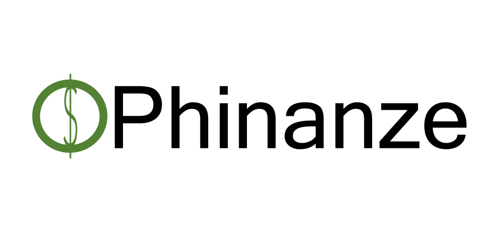
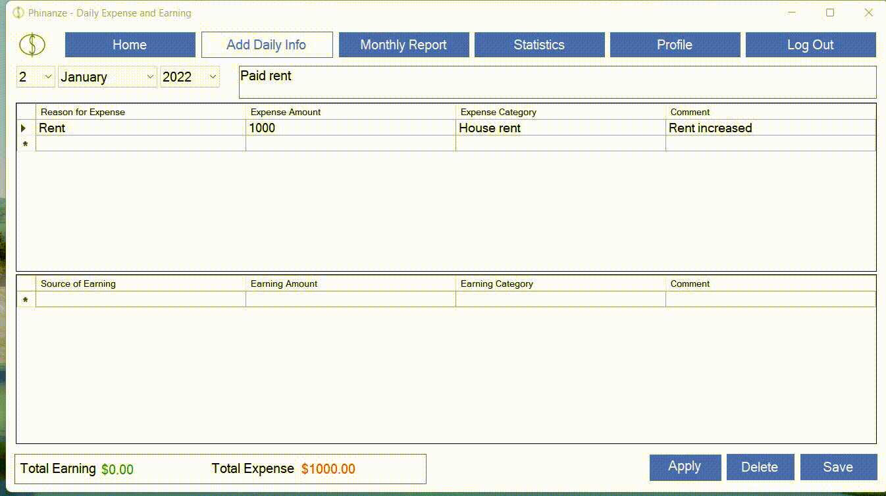

<html>

</html>

              
## Welcome to Phinanze
Phinanze is a Windows PC application for personal finance management that can be used for tracking earnings, expenses, and generating useful reports and statistics. Interactive and easy-to-use design makes the app a convenient tool for simple personal finance management. I developed this application as a hobby project in 2019 summer and initially named it MyCost which I recently changed to Phinanze to better reflect the app's functionality.  

## License
Phinanze is distributed under [MIT License](https://github.com/rezaSaker/Phinanze/blob/master/LICENSE).

## Download the application 
[Click here](https://rezasaker.com/rezasdev/dev/soft/mycost/app/) to install the demo version of Phinanze.

## Upcoming Feature
Budget feature that allows users to set budget for various time periods and categories. 

## Brief Demo of the Application

